## Задание №4 

## Сетевое планирование

1.	Изучить лекционные материалы и дополнительные материалы по теме сетевого планирования.
1.	Выполнить упражнение на освоение техники сетевого планирования. Результат выполнения задания – план работ в MS Project.
1.	Рассчитать резервы времени и коэффициенты напряженности для работ, не лежащих на критическом пути.
1.	Оптимизировать план выполнения работы с целью минимизации продолжительности критических и подкритических работ, обеспечения равномерности загрузки исполнителей с учетом ограничения времени окончания работ.

### Сдача задания

Последовательная демонстрация всех частей (1-6) проекта на рабочем месте в программе MS Porject, сдача только итоговой задачи не допускается.

Удаленная сдача также не допускается из-за обилия скриншотов, которые в любом случае в полном объеме не будут предоставлены, что-нибудь будет забыто.

[Подготовка проекта](https://gitwork.ru/sub/tpro/blob/master/task4_old.md#%D0%BF%D0%BE%D0%B4%D0%B3%D0%BE%D1%82%D0%BE%D0%B2%D0%BA%D0%B0-%D0%BF%D1%80%D0%BE%D0%B5%D0%BA%D1%82%D0%B0)

[Часть 1. Планирование последовательных действий для одного исполнителя.](https://gitwork.ru/sub/tpro/blob/master/task4_old.md#%D1%87%D0%B0%D1%81%D1%82%D1%8C-1-%D0%BF%D0%BB%D0%B0%D0%BD%D0%B8%D1%80%D0%BE%D0%B2%D0%B0%D0%BD%D0%B8%D0%B5-%D0%BF%D0%BE%D1%81%D0%BB%D0%B5%D0%B4%D0%BE%D0%B2%D0%B0%D1%82%D0%B5%D0%BB%D1%8C%D0%BD%D1%8B%D1%85-%D0%B4%D0%B5%D0%B9%D1%81%D1%82%D0%B2%D0%B8%D0%B9-%D0%B4%D0%BB%D1%8F-%D0%BE%D0%B4%D0%BD%D0%BE%D0%B3%D0%BE-%D0%B8%D1%81%D0%BF%D0%BE%D0%BB%D0%BD%D0%B8%D1%82%D0%B5%D0%BB%D1%8F)

[Часть 2. Планирование независимых действий для одного исполнителя.](https://gitwork.ru/sub/tpro/blob/master/task4_old.md#%D1%87%D0%B0%D1%81%D1%82%D1%8C-2-%D0%BF%D0%BB%D0%B0%D0%BD%D0%B8%D1%80%D0%BE%D0%B2%D0%B0%D0%BD%D0%B8%D0%B5-%D0%BD%D0%B5%D0%B7%D0%B0%D0%B2%D0%B8%D1%81%D0%B8%D0%BC%D1%8B%D1%85-%D0%B4%D0%B5%D0%B9%D1%81%D1%82%D0%B2%D0%B8%D0%B9-%D0%B4%D0%BB%D1%8F-%D0%BE%D0%B4%D0%BD%D0%BE%D0%B3%D0%BE-%D0%B8%D1%81%D0%BF%D0%BE%D0%BB%D0%BD%D0%B8%D1%82%D0%B5%D0%BB%D1%8F)

[Часть 3. Планирование действий двух исполнителей при конкуренции за общий ресурс.](https://gitwork.ru/sub/tpro/blob/master/task4_old.md#%D1%87%D0%B0%D1%81%D1%82%D1%8C-3-%D0%BF%D0%BB%D0%B0%D0%BD%D0%B8%D1%80%D0%BE%D0%B2%D0%B0%D0%BD%D0%B8%D0%B5-%D0%B4%D0%B5%D0%B9%D1%81%D1%82%D0%B2%D0%B8%D0%B9-%D0%B4%D0%B2%D1%83%D1%85-%D0%B8%D1%81%D0%BF%D0%BE%D0%BB%D0%BD%D0%B8%D1%82%D0%B5%D0%BB%D0%B5%D0%B9-%D0%BF%D1%80%D0%B8-%D0%BA%D0%BE%D0%BD%D0%BA%D1%83%D1%80%D0%B5%D0%BD%D1%86%D0%B8%D0%B8-%D0%B7%D0%B0-%D0%BE%D0%B1%D1%89%D0%B8%D0%B9-%D1%80%D0%B5%D1%81%D1%83%D1%80%D1%81)

[Часть 4. Использование части ресурса.](https://gitwork.ru/sub/tpro/blob/master/task4_old.md#%D1%87%D0%B0%D1%81%D1%82%D1%8C-4-%D0%B8%D1%81%D0%BF%D0%BE%D0%BB%D1%8C%D0%B7%D0%BE%D0%B2%D0%B0%D0%BD%D0%B8%D0%B5-%D1%87%D0%B0%D1%81%D1%82%D0%B8-%D1%80%D0%B5%D1%81%D1%83%D1%80%D1%81%D0%B0)

[Часть 5. Выбор исполнителя](https://gitwork.ru/sub/tpro/blob/master/task4_old.md#%D1%87%D0%B0%D1%81%D1%82%D1%8C-5-%D0%B2%D1%8B%D0%B1%D0%BE%D1%80-%D0%B8%D1%81%D0%BF%D0%BE%D0%BB%D0%BD%D0%B8%D1%82%D0%B5%D0%BB%D1%8F)

[Часть 6. Задача](https://gitwork.ru/sub/tpro/blob/master/task4_old.md#%D1%87%D0%B0%D1%81%D1%82%D1%8C-6-%D0%B7%D0%B0%D0%B4%D0%B0%D1%87%D0%B0)

[Как проверить проект](https://gitwork.ru/sub/tpro/blob/master/task4_old.md#%D0%BA%D0%B0%D0%BA-%D0%BF%D1%80%D0%BE%D0%B2%D0%B5%D1%80%D0%B8%D1%82%D1%8C-%D0%BF%D1%80%D0%BE%D0%B5%D0%BA%D1%82)

Входными данными для данной задачи является набор действий, которые необходимо выполнить исполнителям, а также сами исполнители, ресурсы, которые они используют, и соответствие между действиями и исполнителями, то есть, кто из исполнителей какую задачу может выполнять.

Необходимо определить зависимость между действиями, их последовательность и исполнителей действий. Цель – спланировать действия в автоматическом режиме к четко заданному времени и с минимальной общей продолжительностью.

Понятия «действие» и «задача» являются синонимами.

Задание состоит в планировании процесса разработки ПО. Необходимо завершить разработку до **20 декабря текущего года** (20 декабря - крайний срок - сдача проекта).

Перед тем как выполнить само задание сначала необходимо выполнить несколько подзаданий, носящих роль обучающих:

[1.](https://gitwork.ru/sub/tpro/blob/master/task4_old.md#%D1%87%D0%B0%D1%81%D1%82%D1%8C-1-%D0%BF%D0%BB%D0%B0%D0%BD%D0%B8%D1%80%D0%BE%D0%B2%D0%B0%D0%BD%D0%B8%D0%B5-%D0%BF%D0%BE%D1%81%D0%BB%D0%B5%D0%B4%D0%BE%D0%B2%D0%B0%D1%82%D0%B5%D0%BB%D1%8C%D0%BD%D1%8B%D1%85-%D0%B4%D0%B5%D0%B9%D1%81%D1%82%D0%B2%D0%B8%D0%B9-%D0%B4%D0%BB%D1%8F-%D0%BE%D0%B4%D0%BD%D0%BE%D0%B3%D0%BE-%D0%B8%D1%81%D0%BF%D0%BE%D0%BB%D0%BD%D0%B8%D1%82%D0%B5%D0%BB%D1%8F)	Планирование последовательных действий для одного исполнителя, то есть действий с четко заданной и заранее определенной последовательностью, например, нельзя начать действие «кодирование» пока не совершено действие «разработка требований». 

[2.](https://gitwork.ru/sub/tpro/blob/master/task4_old.md#%D1%87%D0%B0%D1%81%D1%82%D1%8C-2-%D0%BF%D0%BB%D0%B0%D0%BD%D0%B8%D1%80%D0%BE%D0%B2%D0%B0%D0%BD%D0%B8%D0%B5-%D0%BD%D0%B5%D0%B7%D0%B0%D0%B2%D0%B8%D1%81%D0%B8%D0%BC%D1%8B%D1%85-%D0%B4%D0%B5%D0%B9%D1%81%D1%82%D0%B2%D0%B8%D0%B9-%D0%B4%D0%BB%D1%8F-%D0%BE%D0%B4%D0%BD%D0%BE%D0%B3%D0%BE-%D0%B8%D1%81%D0%BF%D0%BE%D0%BB%D0%BD%D0%B8%D1%82%D0%B5%D0%BB%D1%8F)	Планирование независимых действий для одного исполнителя, то есть действий, четкая последовательность которых не определена, например, действия "Разработка модуля 1" и "Разработка модуля 2" могут быть выполнены в любой последовательности, если иное не определено условиями. 

[3.](https://gitwork.ru/sub/tpro/blob/master/task4_old.md#%D1%87%D0%B0%D1%81%D1%82%D1%8C-3-%D0%BF%D0%BB%D0%B0%D0%BD%D0%B8%D1%80%D0%BE%D0%B2%D0%B0%D0%BD%D0%B8%D0%B5-%D0%B4%D0%B5%D0%B9%D1%81%D1%82%D0%B2%D0%B8%D0%B9-%D0%B4%D0%B2%D1%83%D1%85-%D0%B8%D1%81%D0%BF%D0%BE%D0%BB%D0%BD%D0%B8%D1%82%D0%B5%D0%BB%D0%B5%D0%B9-%D0%BF%D1%80%D0%B8-%D0%BA%D0%BE%D0%BD%D0%BA%D1%83%D1%80%D0%B5%D0%BD%D1%86%D0%B8%D0%B8-%D0%B7%D0%B0-%D0%BE%D0%B1%D1%89%D0%B8%D0%B9-%D1%80%D0%B5%D1%81%D1%83%D1%80%D1%81)	Планирование действий двух исполнителей при конкуренции за общий ресурс. В данном задании появляется ресурс, за который конкурируют исполнители, и который не может быть использован одновременно обоими исполнителями. Например, высокопроизводительный стенд (сервер) для тестирования, который может использовать в определенный момент времени только один исполнитель - тестироваться только один модуль. 

[4.](https://gitwork.ru/sub/tpro/blob/master/task4_old.md#%D1%87%D0%B0%D1%81%D1%82%D1%8C-4-%D0%B8%D1%81%D0%BF%D0%BE%D0%BB%D1%8C%D0%B7%D0%BE%D0%B2%D0%B0%D0%BD%D0%B8%D0%B5-%D1%87%D0%B0%D1%81%D1%82%D0%B8-%D1%80%D0%B5%D1%81%D1%83%D1%80%D1%81%D0%B0)	Использование части ресурса, то есть для выполнения определенного действия нужна только часть ресурса, остальная часть может быть задействована для выполнения другого действия. 

[5.](https://gitwork.ru/sub/tpro/blob/master/task4_old.md#%D1%87%D0%B0%D1%81%D1%82%D1%8C-5-%D0%B2%D1%8B%D0%B1%D0%BE%D1%80-%D0%B8%D1%81%D0%BF%D0%BE%D0%BB%D0%BD%D0%B8%D1%82%D0%B5%D0%BB%D1%8F)	Выбор исполнителя, когда действие может быть выполнено кем-то одним из исполнителей. К сожалению, MS Project не может сам выбрать исполнителя для действия, которое мог бы выполнить кто-то один. Поэтому здесь появляется необходимость выбора самим автором проекта – кому из исполнителей поручить определенное действие, чтобы выровнять нагрузку на исполнителей и минимизировать общее время выполнения задания. 

Все задания необходимо выполнить в автоматическом режиме планирования и к определенному, указаному ранее, сроку.

Приведенные далее скриншоты могут содержать параметры, связанные со временем, отличающиеся указанного в задании, поскольку время может меняться в зависимости от варианта или года обучения.

### Создание клона подготовленной виртуальной машины

Данная виртуальная машина содержит различное ПО для работы на занятиях, нас интересует MS Project (winproj.exe)

1. Открыть приложение VMWare Workstation, выбрать пункт меню "открыть виртуальную машину" (File-Open). Найти и выбрать для открытия виртуальную машину, расположенную в каталоге "D:\Виртуалки учебные", **WIN-CC** (Файл с расширением vmx в соответствующем каталоге). 

2. Выбрать пункт клонирования виртуальной машины (VM-Manage-Clone). В процессе создания выбирать значения по умолчанию. Обратите внимание что необходимо создавать свзанный клон виртуальной машины (Linked Clone). Название виртуальной машины можно изменить. Для понимания: связанный клон, не может работать без исходной виртуальной машины. Связанный клон хранит в себе только изменения относительно исходной виртуальной машины, следовательно, он занимает мало места на жестком диске.

3. Для удобства дальнейшей работы необходимо перевести виртуальную машину в полноэкранный режим (сочетание клавиш Ctrl-Alt-Enter или через меню), открыть браузер в виртуальной машине и открыть данную страницу в нем.

Приложение может быть найдено в меню "пуск" по ключевому слову "Project", или вручную запустить приложение "winproj".

## Подготовка проекта

Прежде чем начать выполнение заданий необходимо настроить MS Project и ваш проект, чтобы в дальнейшем не столкнуться с определенными трудностями. Кроме того, не забывайте сохранять проект, чтобы не потерять изменения и иметь возможность вернуть рабочий проект, в случае возникновения ошибок.

**При выполнении задания в разных класса и на разных компьютерах - проверяйте настройки MS Project и вашего проекта**

Для возможности автоматического планирования необходимо проверить праметры рабочего времени, для этого:
	
*	в настройках MS Project: Меню **«Файл»–>«Параметры»–>«Расписание»** **«время начала по умолчанию»** проверить **9:00**, **время окончания по умолчанию** проверить **18:00**. Здесь же можно установить **«Новые задачи» – Автоматическое планирование**, **«Длительность»** и **«Трудозатараты»** - **дни** и **часы** соответственно и снять галочку с параметра  **«Прерывание выполняющихся задач»**;
*	На вкладке (не в настройках MS Project) **«Проект»–>«Сведения о проекте»** параметр **«Календарь»** установить в значение **Стандартный**. 
    
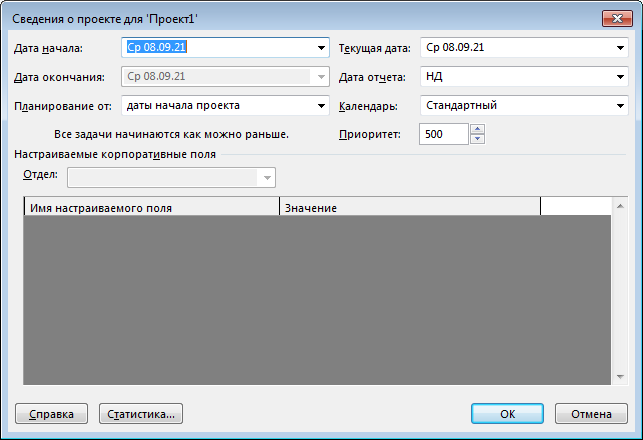

*	**Необязательный пункт. Для случаев когда рабочий день не стандартный.** Можно не меняя календарь изменить рабочее время проекта на желаемое. На вкладке «Проект»–>«Изменить рабочее время» создать исключение с любым именем. Два раза нажать на созданное исключение или нажать кнопку «Подробности», далее установить рабочие часы, например, с 0.00 до 12.00. При этом проверить, что внизу окна в разделе «Пределы повторения» установлена нужная дата, когда планируются задачи (может не соответствовать, если работать над задачей несколько дней);

*	**Необязательный пункт. Для случаев когда длительность действий - минуты.** MS Project в первую очередь предназначен для длительных проектов, поэтому по умолчанию оперирует такими понятиями как «день, неделя и т.п.». Для случаев, когда длительность действий составляет минуты, для удобства представления можно переключиться на длительности в минутах по умолчанию. В настройках MS Project **«Файл»–>«Параметры»–>«Общие»** поставить отображение даты в формате **«ДД.ММ.ГГГГ ЧЧ:ММ»**
	
Удобство переключения между различными режимами представления проекта. В процессе планирования проекта возникает необходимость переключения между различными представлениями, чтобы управлять задачами в различных режимах или посмотреть загруженность ресурсов. Для того чтобы не осуществлять поиск нужного представления в меню, можно включить **«Панель представлений»** в левой части экрана, для этого навести мышку на левую границу экрана, нажать правую кнопку и выбрать «Панель представлений». Наиболее часто используемые представления:
*	**Диаграмма Ганта** – здесь представлен список задач и сама диаграмма. Удобно для редактирования задач;
*	**Сетевой график** – здесь графически показана взаимосвязь задач. Удобно для просмотра взаимосвязи и поиска висящих событий.
*	**Визуальный оптимизатор** – здесь задачи распределены по ресурсам и исполнителям. Удобно при отладке проекта.
*	**График ресурсов** – здесь отображается загрузка ресурсов, при превышении 100% загрузка отображается красным. Удобно для поиска перегрузки.
*	**Лист ресурсов** – здесь перечислены все ресурсы проекта. Удобно для проверки ресурсов, нет ли лишних или дублирующих.

Еще одна настройка, позволяющая более удобно отслеживать задачи с различной длительностью. На «Панели представлений» выбрать Диаграмму Ганта. Далее, правой клавишей по шапке графика–выбрать пункт **«Шкала времени»**. На вкладке **«Нижний уровень»** выбрать единицы **«Дни»**, на вкладке **«Средний уровень»** – **«Недели**». В дальнейшем чтобы поместить все задачи проекта на один экран необходимо здесь же в меню **«Масштаб»** выбрать **«Весь проект»**.	

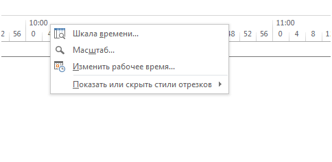

Особенности планирования в автоматическом режиме к определенному сроку, которые необходимо выполнять или проверять при выполнении задания:

*	На вкладке **«Проект»–>«Сведения о проекте»** установить корректные даты проекта. Кроме того установить параметр **«Планирование от»** в значение **«даты окончания проекта»** и указать дату окончания проекта, указанную в задании.

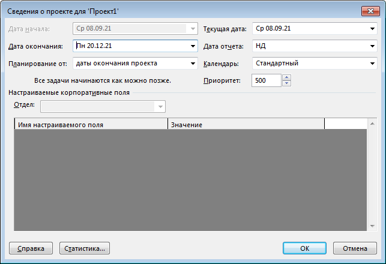

* На вкладке **«Ресурс»–>«Параметры выравнивания»** указать параметры выравнивания. (См. Рисунок).

*	Необходимо устанавливать взаимосвязь всех задач и событий, не должно быть висящих задач, то есть не связанных с предшествующей или последующей задачей или событием. Допускается только два висящих события – это начальное событие **«Начало проекта»** (для нашего примера), не имеющее предшественников и конечное – **«Окончание проекта**», не имеющее последующих.
*	**Не забудьте создать** эти два события **"Начало проекта"** и **"Окончания проекта"** и пометить их как **"веха"** вызвав для события (задачи) **"Cведения"** и перейдя на  вкладку **"Дополнительно"**.

### Далее указана информация, которая потребуется при выполнении всех частей задания к ней можно и нужно вернуться позднее, при первом прочтении это больше запутает вас, так как большинство начнет вносить указанные изменения в проект.

### Перейдите к части 1

*	(**Позже, когда добавите задачи**) Необходимо проверять, что все задачи находятся в автоматическом режиме планирования. **(Данный скриншот приведен как пример, перепечатывать задачи не надо)**

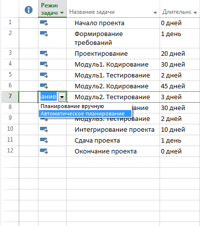

* (**Позже, когда добавите задачи**) Вызвав сведения о задаче (правая клавиша мыши->"сведения" или двойной клик по задаче) на вкладке **«Дополнительно»** для задач установить **«Фиксированную длительность»**, **«Фиксированный объем работ»** и тип ограничения **«Как можно позже»**, так как мы планируем ко времени завершения проекта.
 
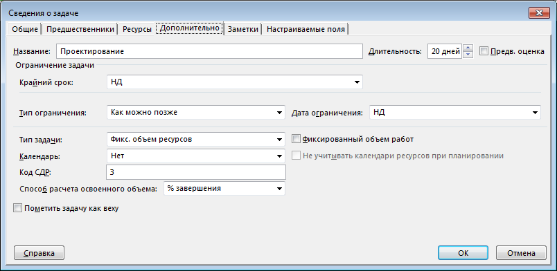

* Этот и последующий пункты посвящены особенностям отладки проекта при автоматическом планировании. К ним можно вернуться позже, при выполнении какого-либо задания и возникновении вопросов.

После настройки проекта и задач для начала автоматического планирования необходимо на вкладке **«Ресурс»** нажать **«Выровнять все»**. При корректной настройке рабочего времени проекта, взаимосвязи заданий и параметров автоматического выравнивания проект должен автоматически спланироваться.
* Возможны возникновение проблем, которые необходимо разрешить вручную, например перегрузка ресурсов, то есть одновременное выполнение нескольких действий.

В списке задач это выглядит так

 

В графике ресурсов – так

В визуальном оптимизаторе

* Для разрешения проблем необходимо в списке задач нажать правой клавишей на «красного человечка» и выбрать **«Перенести на доступную дату»**.

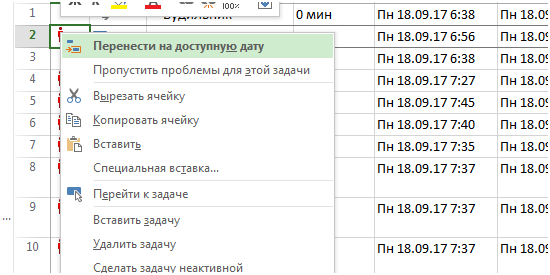

При этом возможно возникновение новых конфликтов, все такие конфликты должны быть разрешены, аналогичным спсобом. **Если** в выпадающем меню **отсутствует** пункт **«Перенести на доступную дату»**, значит задачу не возможно никуда перенести, что связано с какими-либо ограничениями или неправильным планированием, взаимосвязью задач и т.п., например когда во временной промежуток 10 минут, пытается поместиться 3 задачи по 5 минут, что невозможно. В таких случаях необходимо пересмотреть проект.

Одним из способов разрешения подобных конфликтов является смена исполнителей задачи, другим – изменение взаимосвязи задач, возможно, указаны ошибочные или лишние взаимосвязи.

Также при разрешении конфликтов может быть автоматически установлены ограничения для задач, как например на рисунке.

**Ограничение допускается только для последней задачи «Окончание проекта»**, которая должна закончиться в установленный срок для всей задачи.

Для снятия ограничений необходимо для задач на вкладке **«Дополнительно»** снять любое ограничение и установить тип ограничения **«Как можно позже»**.

Чередуя такое выравнивание и разрешение конфликтов необходимо добиться того, чтобы конфликты в сети отсутствовали.

## Часть 1. Планирование последовательных действий для одного исполнителя.

Предлагается спланировать простейшую задачу: В организации существует универсальный разработчик ПО, которому необходимо к 20 декабря текущего года разработать программное обеспечение, при этом ему необходимо выполнить все действия, приведенные в таблице, на забывая про события "Начало проекта" и "Окончание проекта". Задача определить дату начала проекта. Длительность всех действий приведена в той же таблице.

| Действие | Время, дней |
|-|-|
| Формирование требований к ПО | 1 |
| Проектирование ПО | 2 |
| Разработка ПО | 15 |
| Сдача проекта | 1 |

Как видно из перечня действий все они выполняются в том порядке, в котором приведены в таблице.

**Напоминание** Для автоматического планирования необходимо, чтобы в сети было только одно начальное и одно конечное событие. В данном примере это выполняется без введения дополнительных событий, но введем их так как нам они понадобятся в дальнейшем. Начальное событие – «Начало проекта», конечное событие – «Окончание проекта».

Отличие событий и действий – событие не имеет длительности.

В отличие от Лекции, где основной элемент сетевой модели – событие, Microsoft Project оперирует в первую очередь действиями (задачами) и их взаимосвязью.

Для того чтобы создать событие необходимо создать задачу нулевой продолжительности, не использующую ресурсы. В терминах MS Project событие – это веха. Любую задачу можно превратить в веху – на вкладке **«Дополнительно»** сведений о задаче необходимо внизу отметить **«Пометить задачу как веху»**.

* **Создание ресурсов**. На Панели **«Лист ресурсов»** создать ресурс **«Разработчик №1»**. Никакие параметры ресурса не менять. Ресурс должен иметь **тип «Трудовой»**. Ресурс это тот объект, который задействован при выполнении задачи, ресурсом является как сам исполнитель, в данном случае – разработчик, так и используемые им инструменты или другие объекты, например, вычислительный сервер, тестовый стенд и т.п.

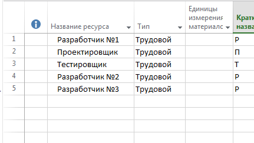

Ресурс может быть создан и непосредственно при редактировании задачи на вкладке "Ресурсы", где можно выбрать в выпадающем списке из существующих ресурсов, а при отсутствии необходимого, ввести его название он создастся автоматически.

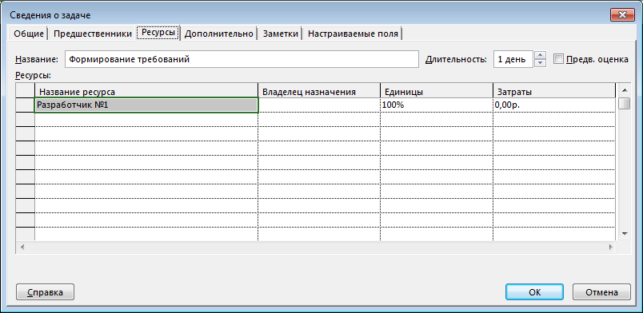 

* **Ввод задач**. На **Диаграмме Ганта** в списке задач ввести приведенные ранее в таблице задачи (действия) для Разработчика №1, а также два события, связанных с началом и окончанием проекта. **При вводе задач кроме длительности указать ресурс «Разработчик №1»**.

* **Взаимосвязь задач**. Взаимосвязь задач указывается в сведениях о задаче **на вкладке «Предшественники»**. Здесь можно выбрать задачи которые должны быть завершены до начала текущей.

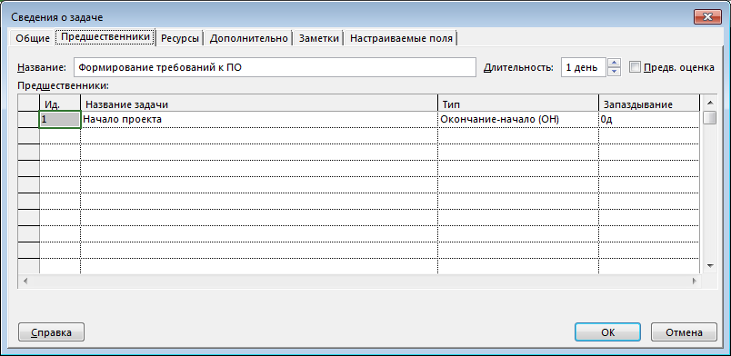

* После указания взаимосвязи всех задач и событий, а также правильной настройки проекта для автоматического планирования все задачи должны выстроиться последовательно друг за другом, при этом их **окончание будет 20 декабря**.

При возникновении проблем уже можно обращаться к разделу, который предлагалось пропустить, поскольку в нем указаны типовые ошибки и как их разрешить.

## Часть 2. Планирование независимых действий для одного исполнителя.

Усложним задачу - пусть наше разрабатываемое ПО состоит из двух модулей и разработчик может разрабатывать их в любом порядке - снала первый, потом второй или наоборот
Переименуем действие **"разработка ПО"** в **"Разработка модуля 1"** и добавим действие **"Разработка модуля 2", также добавим действие **"Интеграция ПО"**, поскольку два разработанных модуля необходимо проверить на взаимную работоспособность.
Логично, что эти действия должны быть выполнены **после того, как завершено проектирование ПО и до сдачи проекта**, кроме того разработка модулей **должна быть завершена до начала интеграции**, но **между собой они могут быть выполнены в любой последовательности**.

| Действие | Время, дней |
|-|-|
| Формирование требований к ПО | 1 |
| Проектирование ПО | 2 |
| **Разработка модуля 1** | **15** |
| **Разработка модуля 2** | **10** |
| **Интеграция ПО** | **2** |
| Сдача проекта | 1 |

В данном случае необходимо правильно указать зависимость между задачами. **Для каждого из действий по разработке модулей** предшествующим действием будет **"Проектирование ПО"**, а последующим **"Интеграция ПО"**. 

Других зависимостей в данном примере нет, соответственно, эти два независимых между собой действия будут автоматически спланированы в любой последовательности.

Часть сетевого графика с этими заданиями будет выглядеть примерно вот так

После указания всех взаимосвязей и рекомендуемых настроек задач и проекта, приведенных ранее, проект либо сам автоматически расставит задачи, либо необходимо на вкладке **«Ресурс»** выбрать команду **«Выровнять все»**. Если возникают ошибки, то необходимо перепроверить настройки проекта и задач.

## Часть 3. Планирование действий двух исполнителей при конкуренции за общий ресурс.

Следующим шагом в усложнении задачи является добавление еще одного исполнителя в проект. Допустим, у нас появляется такой исолнительн (ресурс) как **"Разработчик №2"**, который разрабатывает тоже два модуля - "модуль 3" и "модуль 4", с отличным от первого разработчика временем исполнения. Перечень действий, кто из исполнителей их проихводит и время их выполнения каждым исполнителем приведена в таблице.

| Действие | Разработчик №1 - Время, дней | **Разработчик №2 - Время, дней** |
|-|-|-|
| Формирование требований к ПО | 1 | |
| Проектирование ПО | 2 | |
| Разработка модуля 1 | 15 | |
| Разработка модуля 2 | 10 | |
| **Разработка модуля 3** | | **10** |
| **Разработка модуля 4** | | **5** |
| Интеграция ПО | 2 | 2 |
| Сдача проекта | 1 | |

Соответственно, в наш проект необходимо **добавить** еще один **ресурс** – **«Разработчик №2»**, а также все соответствующие ему задачи и взаимосвязь задач.

Кроме того, дополнительным условием является то, что "модуль 1" и "модуль 3", это сепцифичные модули для разработки которых требуется некоторый **специализированный компьютерный стенд**, который имеется в единственном экземпляре, и работать с ним может только один разработчик. Значит задачи "Разработка модуля 1" и " Разработка модуля 3" не могут выполняться одновременно разными исполнителями, покольку специализированный компьютерный стенд занят.

Для устранения этой проблемы необходимо **добавить новый ресурс** – **«Компьютерный стенд»**, и задействовать его в соответствующих задачах – **«Разработка модуля 1»** и **«Разработка модуля 3»** как второй ресурс.

При добавлении нового ресурса в существующие задачи **может возникнуть предупреждение**, говорящее **об увеличении количества ресурсов и** соответственно, **сокращении времени выполнения**. Необходимо, **выбрать вариант с сохранением времени выполнения**, или подправить время выполнения, в соответствии с заданным.

Кроме того, необходимо учитывать, что **задача "Интеграция ПО" имеет два ресурса-исполнителя** - "Разработчик №1" и "Разработчик №2". К началу выполнения этой задачи все модули должны быть разработаны. Разработка всех модулей начинается после проектирования.

После указания всех взаимосвязей и рекомендуемых настроек задач и проекта, приведенных проект должен сам автоматически расставить задачи. В противном случае необходимо перепроверить проект и выполнить выравнивание, как описывалось ранее.

Правильным результатом будет выполнение всех действий исполнителями до заданного времени и отсутствие перегрузки ресурсов, обратите внимание у второго разработчика имеется свободное время в данном проекте, которое он может потратить на улучшение текущего проекта или поработать над другим проектом.

## Часть 4. Использование части ресурса.

Если посмотреть сведения любой задачи на вкладке **«Ресурсы»** то можно обратить внимание, что для каждого ресурса указывается размер используемого ресурса как 100%. Но это не всегда так в реальной жизни. Например, в рассматриваемой нами далее задаче появляется такой процесс как **"документирование модуля"**, хороший разработчик разрабатывает документацию на модуль в процессе разработки этого модуля, а не в конце, так как на это может не хватить времени. Значит разработчик как ресурс используется частично для задачи "Разработка модуля" и частично для "Документирование модуля", установим соотношение занятости как 75% и 25%, соответственно (см. таблицу).

В задачу **добавляется** действие для Разработчика №1, **"Документирование модуля 1"**, которое он может выполнить параллельно действию "Разработка модуля", за счет указания степени загрузки ресурса.

| Действие | Разработчик №1 - Время, дней | Разработчик №2 - Время, дней |
|-|-|-|
| Формирование требований к ПО | 1 | |
| Проектирование ПО | 2 | |
| Разработка модуля 1 | **15 (75%)** | |
| Документирование модуля 1 | **15 (25%)** | |
| Разработка модуля 2 | 10 | |
| Разработка модуля 3 | | 10 |
| Разработка модуля 4 | | 5 |
| Интеграция ПО | 2 | 2 |
| Сдача проекта | 1 | |

Поскольку с загрузкой ресурсов в 75% и 25% мы определились, необходимо, **определить взаимосвязь задачи "Документирование модуля 1"**. Если раньше мы рассматривали такую связь задач как **окончание-начало**, то есть после окончания одной задачи начиналась друга, то для данной задачи такая связь меняется. Действиятельно, было бы странно начинать документирование модуля сразу после проектирования, не начав его разработку, предположим, что документирование начинается одновременно с разработкой подуля и **установим предшественником** задачу "Разработка модуля 1", **но укажем тип связи "Начало-начало"**, то есть данные задачи должны начаться одновременно. **Последующей задачей** необходимо установить "интеграция ПО", поскольку нельзя начать интеграцию, не закончив документирование.

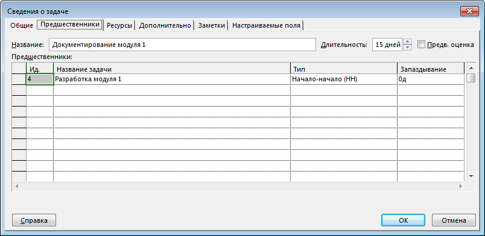

**Обратите внимание** на **возможное изменение длительности** выполнения задачи при изменении загрузки ресурса до 75% и 25%. Программа постарается сохранить трудозатраты и увеличить выполнение задачи по времени. Необходимо сохранить длительность выполнения задачи.**Проверьте**

Несмотря на то, что на визуальном оптимизаторе у ресурса «Разработчик №1» показывает одновременное выполнение двух задач, **перегрузки ресурсов не происходит**, поскольку они используются по в сумме не более 100%.

## Часть 5. Выбор исполнителя

Все описанные выше варианты и возможности предусматривали однозначное решение, поскольку в условиях задания были четко определены задачи, их взаимосвязь и исполнители. Но **если существует возможность выбрать исполнителя**, тогда появляется возможность выбора – **минимизация времени** выполнения всего проекта, либо минимизация загрузки определенного исполнителя. **MS Project делать этого автоматически не умеет**, в случае наличия различных вариантов исполнителей **необходимо самостоятельно выбрать** того или иного **исполнителя** для всех таких задач добиваясь минимального времени выполнения проекта.

Дополнительное условие – необходимо провести **отладку модуля 3**, эту задачу может выполнять как **Разработчик №1**, так и **Разработчик №2**, при этом время выполнения задачи в зависомсти от исполнителя - разное.

| Действие | Разработчик №1 - Время, дней | Разработчик №2 - Время, дней |
|-|-|-|
| Формирование требований к ПО | 1 | |
| Проектирование ПО | 2 | |
| Разработка модуля 1 | 15 (75%) | |
| Документирование модуля 1 | 15 (25%) | |
| Разработка модуля 2 | 10 | |
| Разработка модуля 3 | | 10 |
| Разработка модуля 4 | | 5 |
| **Отладка модуля 3 (задача выполняется один раз)** | **2** | **5**|
| Интеграция ПО | 2 | 2 |
| Сдача проекта | 1 | |

Фактически необходимо рассмотреть **два варианта проекта**, в одном отладку проводит Разработчик №1, во втором - Разработчик №2.

В каждом варианте проекта необходимо определить предшествующую и последующую задачу. В данном случае для обоих вариантов предшествующей задачей будет **«Разработка модуля 3»*, поскольку нельзя начинать отладку не имея самого модуля, а последующей задачей - **"Интеграцмя ПО"**, так как нельзя начать интеграцию е имея рабочего и отлаженного модуля.

Для варианта, когда отладку модуля проводит Разработчик №1 время проекта составляет 33 дня. Для варианта с Разработчиком №2 - 31 день.

Посмотреть время выполнения проекта можно выбрав на вкладке **"Проект"**, параметр **"Сведения о проекте"** и выбрав **"Статистка"**

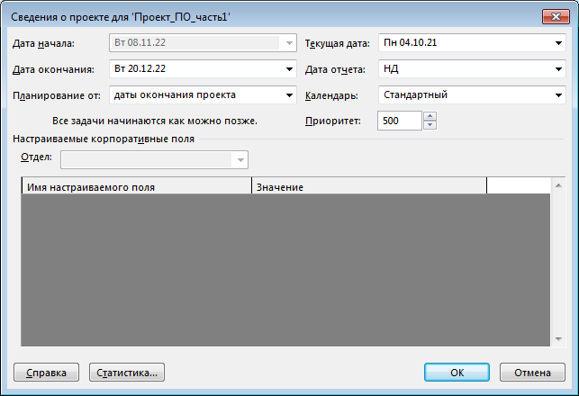

## Часть 6. Задача

Перед тем как сформулировать непосредственно саму задачу, предлагается рассмотреть такой вариант как использование событий (вех) внутри проекта, а не только начальное событие и конечное событие для всего проекта. Это может быть удобным для проектов, которые часто изменяются и чтобы не потерять связи между задачами. Введение такого события сокращает связи между задачами и снижает риск ошибок при планировании, при изменнии связей, добавлении новых задач и изменении исполнителей, особенно в случаях, когда после завершения группы из нескольких задач, может начинаться группа других задач.

Например, В рассмотренных ранее примерах необходимо проводить интеграцию ПО только после готовности модулей, соответственно, **можно ввести событие "Модули готовы"**, для данного события предшествующими задачами будут задачи разработки и отладки модулей, а последующими задачами будут "Интеграция ПО" и "тестирование", или событие "Требования к ПО готовы", после которого можно начинать разработку архитектуры, тестов и самих модулей.

В дальнейших формулировках задач будет некоторое упрощение, поскольку данная задача учебная, в реальности взаимосвязь задач гораздо сложнее, их параллельность выполнения выше. В текущем задании будут четко описаны условия, и ограничения для задач.

**Задача** состоит в планировании процесса разработки программного обеспечения от стадии формирования требований до сдачи заказчику готового ПО.

В процессе разработки ПО и формирования требований к нему участвует **Заказчик, Проектировщик, Тестировщик и три Разработчика**, все они могут выполнять только определенные действия, полный перечень задач, которые необходимо выполнить, а также кто и какие задачи может выпонять приведен в таблице.

Задачи, представленные в таблице, не обязательно должны идти в той последовательности, в которой представлены – отдельные задачи являются независимыми между собой. Необходимо определить зависимость задач между собой, если она явно не указана, а также необходимые ресурсы на основании анализа текста задания и условий.

Перед коллективом разработчиков поставлена задача разработать программное обеспечение, требования к которому полностью определяет **Завазчик**, сдача проекта назначена **на 20 декабря текущего года**, в сдаче участвует закачик, как принимающая сторона, и представители команды разработчиков, точных участников процесса сдачи проекта можно определить из таблицы.

На основании требований, подготовленных заказчиком необходимо провести проектирование ПО и определить его **архитектуру**, из которой будет понятен состав ПО, то есть перечень модулей, которые необходимо разработать разработчикам.

Подготовленная архитектура ПО позволяет проектировщику начать разрабатывать **набор системных тестов** ко всему ПО, которые можно будет проводить в конце разработки для доказательства правильности и корректности разработки, что все требования заказчика учтены и реализованы. После проведения такого тестирования потребуется устранение выявленных недостатков, и только потом уже сдача работы заказчику.

Кроме этого подготовленная архитектура позволяет начать разработку **документацию всего ПО**, которое в дальнейшем будет дополнено **документацией на отдельные модули**, которая разрабатывается параллельно с модулями.

Кто разрабатывает конкретный модуль зависит от способностей и квалификации разработчика, это указано в таблице, тестирование модуля проводит любой другой разработчик, а вот исправление выявленных недостатков, то есть **отладку** проводит непосредственно разработчик этого модуля.

Документацию на каждый модуль разрабатывает разработчик этого модуля параллельно с разработкой самого модуля, сроки разработки модуля и документации к нему совпадают, распределение сил для планирования разработки модуля и документации к нему  - 75% / 25 %, как в рассмотренном ранее примере.

Прежде чем начать тестирования ПО целиком, необходимо провести его интеграцию, это можно делать только тогда, когда всемодули готовы, протестированы и отлажены.

Перед тестированием проекта целиком также должна быть готова документация на ПО, которая состоит из общей документации, которую начинают разрабатывать сразу после понимания архитектуры ПО, и документации на отдельные модули, которая разрабатывается параллельно с модулями.

Ограничение - "Модуль 1" и "Модуль 3" используют для разработки **специализированный компьютерный стенд**, который может использоваться одновременно для разработки только одного модуля.

Затраты времени на все действия исполнителей приведены в таблице, обратите внимания на действия, которые необходимо выполнить только один раз одному из членов команды. Нельзя изменять количество работ или их продолжительность. Необходимо составить план работ с использованием MS Project. Обеспечить выравнивание человеческих ресурсов и минимизировать общее время выполнения проекта.

Определить дату, когда необходимо начать проект, чтобы время выполнения проекта было минимальным. 

**Действия, в которых участвует Заказчик** 

| Действие | Время, дней |
|-|-|
| Формирование требований к ПО | 5 |
| Сдача проекта  (действие выполняется один раз) | 1 |

**Действия, в которых участвуют Проектировщик и Тестировщик** 

| Действие | Проектировщик - Время, дней | Тестировщик - Время, дней |
|-|-|-|
| Проектирование ПО | 3 | |
| Сдача проекта (действие выпоняется один раз) | 1 | 1 |
| Разработка тестов для всего проекта | 10 | |
| Тестирование всего ПО | | 5 |
| Разработка общей документации для всего проекта | 10 | |
| Интеграция документации проекта (действие выполняется один раз) | 2 | |
| Устранение недостатков проекта (действие выполняется один раз) | 2 | |

**Действия, в которых участвуют три разработчика** (каждое действие выполняется один раз, указание различных исполнителей подразумевает, что данную задачу может выполнить кто-то из них один)

| Действие | Разработчик №1 - Время, дней | Разработчик №2 - Время, дней | Разработчик №3 - Время, дней |
|-|-|-|-|
| Разработка модуля 1  (требуется стенд) | 15 (75%)| | 20 (75%)|
| Документирование модуля 1 | 15 (25%)| |  20 (25%)|
| Тестирование модуля 1  | 1 | 2 | 1 |
| Отладка модуля 1 (требуется стенд) | 2 | | 3 |
| Разработка модуля 2 | | 10 (75%) | |
| Документирование модуля 2 | | 10 (25%)| |
| Тестирование модуля 2 | 1 | 1 | 2 |
| Отладка модуля 2 | | 2 | |
| Разработка модуля 3 (требуется стенд)| 15 (75%) | | 10 (75%)|
| Документирование модуля 3 | 15 (75%) | | 10 (25%) |
| Тестирование модуля 3 | 1 | 2 | 2 |
| Отладка модуля 3 (требуется стенд) | 1 | | 2 |
| Разработка модуля 4 | | 5 (75%) | |
| Документирование модуля 4| | 5 (25%)| |
| Тестирование модуля 4 | 1 | 1 |1  |
| Отладка модуля 4 | | 1 | |
| Интеграция документации проекта | 2 | 2 | 2 |
| Интеграция ПО | 2 | 2 | 2 |
| Устранение недостатков проекта  | 2 | 2 | 2 |
| Сдача проекта | 1 | 1 | 1 |

Допускается введение дополнительных событий, ограничивающих определенные действия, для сокращения количества связей между заданиями. Например, событие **«Архитектура готова»** наступает после того как, завершено **"проектирование ПО"** и только после этого можно приступать к разработке модулей, документации проекта и системных тестов. 

При построении сети необходимо выполнять правила построения: 

* Не должно быть тупиковых событий и задач, то есть любые события и задачи должны быть связаны с каким-то последующим событием или задачей, например, все задачи по дому должны быть выполнены до того как исполнитель начнет одеваться.

Исключение – завершающее событие **«Окончание проекта»**.

* Не должно быть более одного стартового события или процесса, то есть у любых задачи или события должен быть предшественник.

Исключение – стартовое событие **«Начало проекта»**.

* В сети не должно быть циклов и петель.

Данные правила начинают играть свою роль при автоматическом планировании решения задачи, когда программа будет анализировать сеть.

Учесть при планировании, какие задачи должны выполняться каждым исполнителем, а какие только один раз. При этом, **при смене исполнителя** необходимо учитывать **изменение времени**, которое ему потребуется для выполнения задачи, а также возможное изменение взаимосвязи задач.

## Как проверить проект

1. Окончание проекта в указанную в условиях дату.

2. Полнота использования ресурсов: минимально достаточный перечень ресурсов это исполнители и ресурсы, за которые идет конкуренция:
    * Заказчик; 
    * Разработчик №1;
    * Разработчик №2;
    * Разработчик №3;
    * Проектировщик;
    * Тестировщик;
    * Специализированный компьютерный стенд;
    
3. Не должно быть прерывания задач, то есть если разработчик начал разработку модуля, он не должен начать делать другие задачи до окончания разработки модуля, за исключением задачи документирования модуля, которая выполняется параллельно, но в любом случае не прерывает разработку модуля, а ведется **параллельно**. В определенных режимах планирования программа допускает такое действие, необходимо это исключить настройками проекта.

4. Отсутствие перегрузки ресурсов – проверить вкладки «график ресурсов» и «визуальный оптимизатор».

**Не должно быть**:

**Должно быть**:

